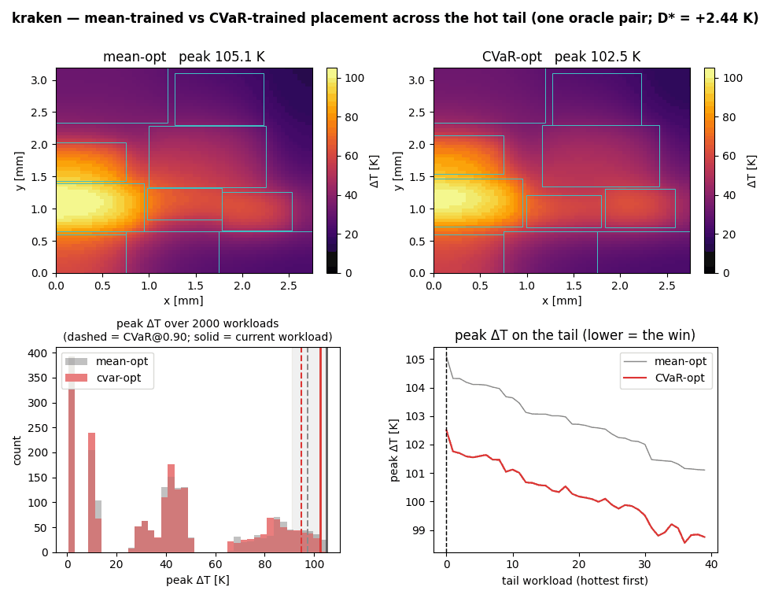
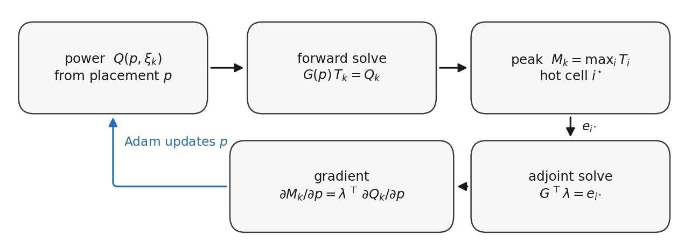
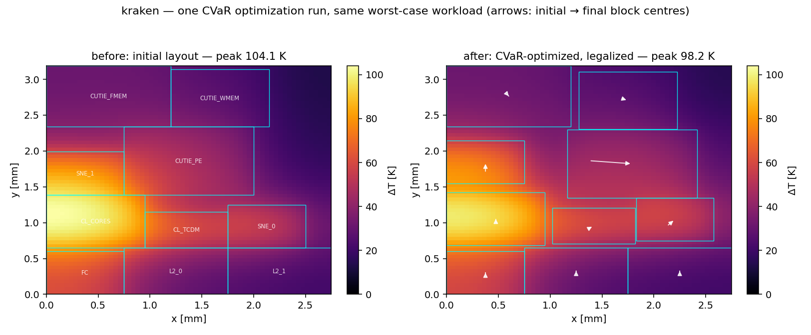

# Pyrova — Differentiable 2D Thermal Tail-Risk Placement
A 2D differentiable macro placer for thermal tail risk under uncertain workload power.
It optimizes a conditional-value-at-risk (CVaR) on peak temperature —
minimizing the CVaR of peak temperature over a distribution of workload power maps.

### When does optimizing thermal tail risk outperform mean optimization on unseen workloads?

Mean- vs CVaR-trained placement across the 40 hottest of 2000 test workloads.
Illustrative run. Across 20 independent train/evaluation replicates this
testbed averages +0.63 K [−0.20, +1.46].

Long story short:

- The improvement is measurable but small. Where workloads exhibit distinct operating modes whose hotspots migrate between anti-correlated high-power blocks, and the die provides sufficient placement freedom, our two strongest measurements are +0.066 K [+0.04, +0.09] and +0.062 K [+0.02, +0.11].
- Neither die size nor wirelength constraints materially change that estimate.

## How it works

Each optimization step solves the thermal field for every workload, computes the gradient of peak temperature with respect to every block position, and combines those
gradients into a single placement update. Under a mean objective every workload
contributes equally; under CVaR, the hottest workloads receive greater weight.

Resulting placement on our model of the
[Kraken](https://arxiv.org/abs/2209.01065) nano-UAV SoC under the same
worst-case workload:

The optimizer increases the separation between blocks that are frequently
co-active, reducing heat accumulation under the hottest workload scenarios.
Arrows show each block's displacement from its initial to its optimized
location.

## Testbeds

The evaluation spans six testbeds, ordered by the fidelity of their power
data — the primary factor governing how broadly each result generalizes.

| Testbed | Blocks | Nets | Die [mm²] | Geometry / netlist | Power | Source/Reference |
|---|---:|---|---:|---|---|---|
| BOOM | 27 | real (McPAT hierarchy) | 2 | synthesized from block areas | real — 80 programs | [core](https://github.com/riscv-boom/riscv-boom) · [dataset](https://github.com/zhaijw18/mcpat-calib-public) |
| Kraken | 10 | — | 9 | modeled from published areas | anchored — silicon measurements | [SoC paper](https://arxiv.org/abs/2209.01065) · [paper](https://arxiv.org/abs/2212.00688) |
| EV6 | 30 | real (ev6.desc) | 256 | real — HotSpot | synthetic — i.i.d. | [code](https://github.com/uvahotspot/HotSpot) · [paper](https://doi.org/10.1109/TVLSI.2006.876103) |
| ami33 | 33 | real (78 nets) | 108 | real — MCNC | synthetic — i.i.d. | [benchmark](http://vlsicad.eecs.umich.edu/BK/) |
| hetero-SoC | 12 | synthetic (6 nets) | 143 | synthesized | synthetic — 6 modes | this repo |
| structured | 30 | — | 256 | real — EV6 geometry | synthetic — tunable modes | this repo |

Detailed description of each testbed

- **BOOM** — power characterized on the [BOOM](https://github.com/riscv-boom/riscv-boom)
  out-of-order RISC-V core (three configurations) across **80 kernel and
  ISA-test programs** — [Embench](https://github.com/embench/embench-iot)/MiBench
  kernels plus [riscv-tests](https://github.com/riscv-software-src/riscv-tests)
  microbenchmarks — via the calibrated
  [mcpat-calib](https://github.com/zhaijw18/mcpat-calib-public) dataset (set
  `BOOM_DATA`). Per-block power and netlist are **real**; only the block
  geometry is synthesized from areas. Loader:
  [boom_traces.py](pyrova/workloads/boom_traces.py).
- **Kraken** — a *model* of the [Kraken](https://arxiv.org/abs/2209.01065)
  nano-UAV SoC (SNE/CUTIE/cluster), **anchored** to published per-subsystem
  silicon powers and the die/[CUTIE](https://arxiv.org/abs/2212.00688) macro
  areas; block splits, duty cycles, and activity noise are **our assumptions**,
  total power scaled to a 40 K operating point. Not a measurement on Kraken.
  Loader: [kraken_soc.py](pyrova/workloads/kraken_soc.py).
- **EV6** — the Alpha 21264 floorplan and connectivity distributed with
  [HotSpot](https://github.com/uvahotspot/HotSpot), **real** geometry/netlist
  ([ev6.desc](pyrova/inputs/floorplans/ev6.desc)); power is **synthetic** i.i.d.
- **MCNC ami33** — the [MCNC](http://vlsicad.eecs.umich.edu/BK/) block-placement
  benchmark (33 blocks, 78 signal nets, YAL), **real** geometry/netlist; power
  is **synthetic** i.i.d. The dense-netlist substrate for wire-constrained runs.
- **Heterogeneous SoC** — **synthesized**: an engineered laptop-class SoC in
  which 6 workload modes each drive a different heavy engine (the workload
  structure required for a CVaR advantage, by construction; existence tests
  only). Loader: [hetero_soc.py](pyrova/workloads/hetero_soc.py).
- **Parametric structured** — **synthesized**: a tunable
  anti-correlated-cluster model on EV6 geometry, for mechanism sweeps. Loader:
  [structured.py](pyrova/workloads/structured.py).

## Results

D\* = out-of-sample CVaR(mean-trained) − CVaR(CVaR-trained), measured on
legalized placements at an independent finer grid. Intervals are 95%;
parentheses point to the experiment script that produced each number.

| Testbed | Unconstrained | Wire-constrained |
|---|---|---|
| BOOM | inconclusive — all intervals span zero; the public corpus (80 programs) cannot resolve effects this small at α = 0.9 (exp009, exp041) | inconclusive — same corpus limit |
| Kraken | +0.63 K [−0.20, +1.46] — not significant over 20 runs; an earlier 5-run +1.80 did not replicate (exp044) | not testable — no netlist |
| EV6 | +0.062 K [+0.02, +0.11] — significant; requires ~6000 training scenarios (exp039) | not testable — die fully utilized, nothing to compress |
| MCNC ami33 | null — as expected under i.i.d. power (exp040) | null at every λ — wirelength budget binding, 17% wire compression (exp040) |
| ami33 × modal power | +0.05 K — not significant, even on a small hot die (exp043) | null at every λ — structure present and budget binding (exp043) |
| hetero-SoC | +0.066 K [+0.04, +0.09] — significant; flat across 9–143 mm² dies (exp023, exp033, exp042) | not testable — netlist too sparse for the budget to bind (exp040) |
| structured | null — an apparent positive traced to a training-grid artifact (exp020) | — |

A measurable advantage appears only when workloads exhibit distinct operating modes that shift the hotspot between anti-correlated heavy blocks, and even then it is only about 0.06 K. The two strongest measurements (+0.066 K and +0.062 K) agree closely, while larger early estimates did not replicate under stricter evaluation. Neither die geometry nor wirelength constraints materially change this result. The available evidence suggests that any true effect is unlikely to be substantially larger. In steady-state 2D conduction, lateral heat spreading already smooths most workload variation, leaving little room for tail-risk optimization to outperform mean optimization.

## Reproduce

Setup and verification:

    python -m venv .venv && source .venv/bin/activate
    make install
    make verify

`make verify` runs the two gates that must pass before any change to the
numerics lands:

- `pyrova/tests/golden.py` — bit-level snapshot of the solver field, peak,
  adjoint gradient, and placer objectives. Per-platform (BLAS-dependent);
  regenerate on a new machine with `make golden`.
- `pyrova/tests/test_gradients.py` — finite-difference checks of every
  gradient path (max-error asserts, subgradient kinks detected and exempted).

Each result file in `pyrova/results/` is produced by exactly one script in
`pyrova/experiments/`; run it directly, or `make reproduce` for the quick
self-contained set. The larger studies take hours to days; every result file
opens with the exact configuration that produced it.

The real-workload experiments need the BOOM dataset (GPL):

    git clone --depth 1 https://github.com/zhaijw18/mcpat-calib-public.git
    export BOOM_DATA=$(pwd)/mcpat-calib-public

## Repository layout

    pyrova/thermal/       finite-difference thermal solver and adjoint gradients
    pyrova/optimizer/     gradient-based macro placer and legalization
    pyrova/objectives/    CVaR, wirelength, overlap, and density objectives
    pyrova/workloads/     workload models and dataset loaders
    pyrova/evaluation/    evaluation metrics and statistical analysis
    pyrova/experiments/   reproducible experiment scripts
    pyrova/inputs/        floorplans and thermal configurations
    pyrova/results/       generated experiment outputs